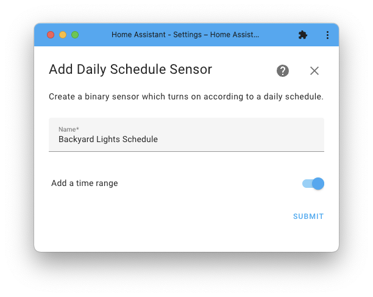
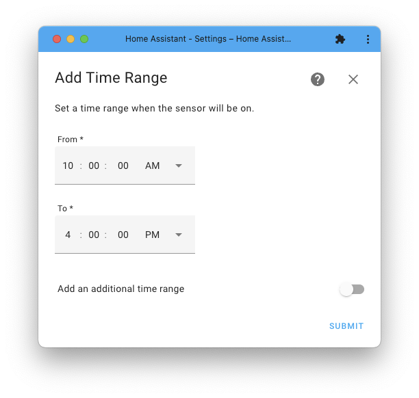
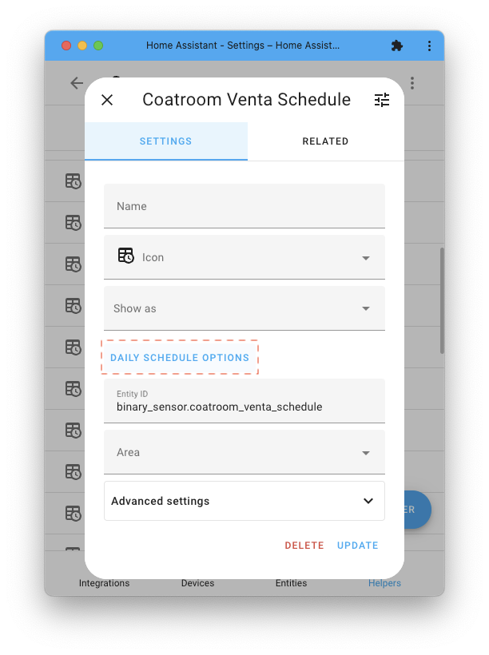
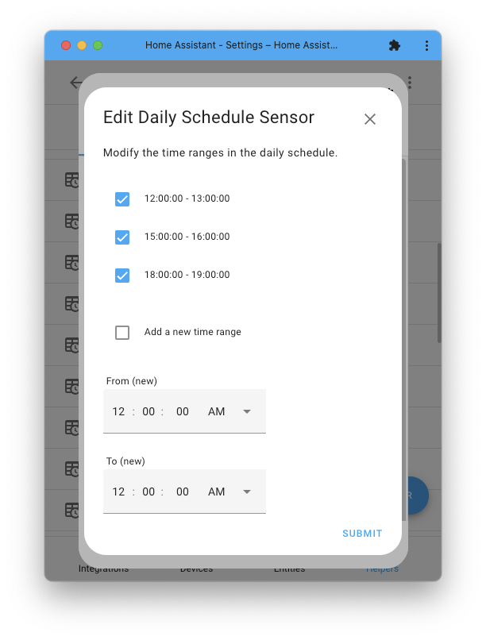

# Daily Schedule

[![GitHub Release][releases-shield]][releases]
[![License][license-shield]](LICENSE)

[![hacs][hacsbadge]][hacs]
![Project Maintenance][maintenance-shield]

The Daily Schedule integration provides a binary sensor that gets its ON/OFF state according to the user-defined schedule.
A schedule is a list of time ranges (FROM and TO).

A demo video clip can be found [here](https://youtu.be/3cVtPPC3S4U).

## Adding Daily Schedule

Use this link:

Or, in the Home Assistant UI go to:

<table border="0"><tr>
<td>
    
</td>
<td valign="top">=></td>
<td>
    
</td>
<td valign="top">=></td>
<td>
    
</td>
<td valign="top">=></td>
<td valign="top">click "+ Create helper" button and search for "Daily Schedule".</td>
</tr></table>

Follow the UI flow to provide a name and set the time ranges.

## Editing Daily Schedule

In the Home Assistant UI go to:

<table border="0"><tr>
<td>
    
</td>
<td valign="top">=></td>
<td>
    
</td>
<td valign="top">=></td>
<td>
    
</td>
<td valign="top">=></td>
<td valign="top">find and click the entry on the list</td>
<td valign="top">=></td>
<td valign="top">click the "Daily Schedule Options".</td>
</tr></table>

Follow the UI flow to add or remove time ranges:
1) Uncheck a time range to remove it.
2) Check the "Add a new time range" for adding a new time range.
3) It's not possible to edit a time range. Instead, remove the exsiting one and add a new one, which can be done in a single step.

## Schedule Validation
1. Time range length must be positive (not zero or negative).
2. Time ranges can’t overlap but can adjust.
3. The TO of the latest time range (in the day) can be smaller or equal to its FROM, and it will be treated as a time in the following day.
    - This means that the binary sensor will be always ON when there is a single time range with the same FROM and TO.

## Contributions are welcome!

If you want to contribute to this please read the [Contribution guidelines](CONTRIBUTING.md)

<!---->

***

[hacs]: https://github.com/custom-components/hacs
[hacsbadge]: https://img.shields.io/badge/HACS-Custom-orange.svg?style=for-the-badge
[license-shield]: https://img.shields.io/github/license/amitfin/daily_schedule.svg?style=for-the-badge
[maintenance-shield]: https://img.shields.io/badge/maintainer-Amit%20Finkelstein%20%40amitfin-blue.svg?style=for-the-badge
[releases-shield]: https://img.shields.io/github/release/amitfin/daily_schedule.svg?style=for-the-badge
[releases]: https://github.com/amitfin/daily_schedule/releases

